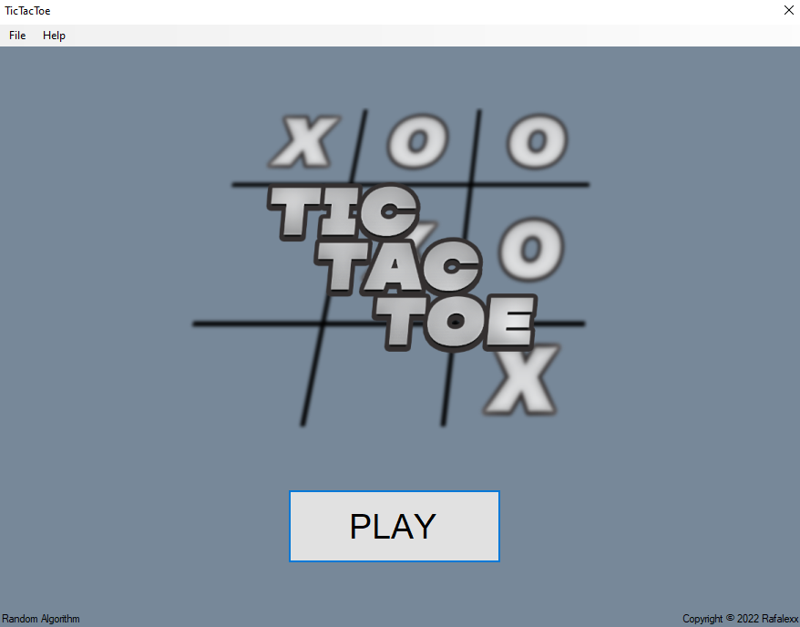

# TicTacToe_WF
### About
A simple game of TicTacToe, with a standard 3x3 playing field. Support for playing in 3 modes.

First you can play: Player vs Player.

Second you can play vs AI (based on random algorithm).

And the last one: you can watch game: AI vs AI.

### Installation Instructions
Currently, to install the game you have two options:

#### Option 1 - Building from source
Open up the file WF_TicTacToecToe.sln` in Visual Studio (or any other .NET IDE), and build all the projects.

#### Option 2 - Download the exe file
Just download the exe file from the Debug folder and run it. 

### FAQ
##### What are your plans on incorporating feature X?
I would like to add Brute-force algorythm. Also, if you would like to see a feature implemented, create an issue (I will try to review and something change eventually).